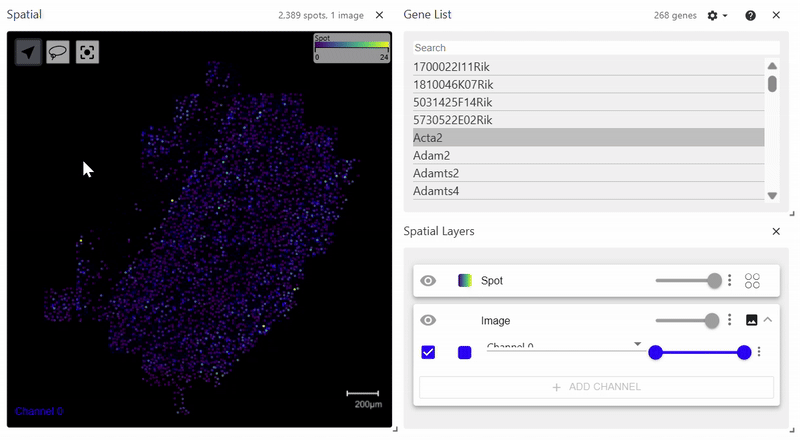
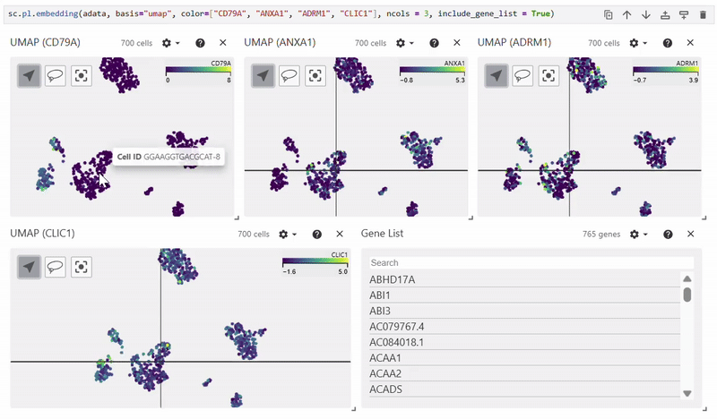
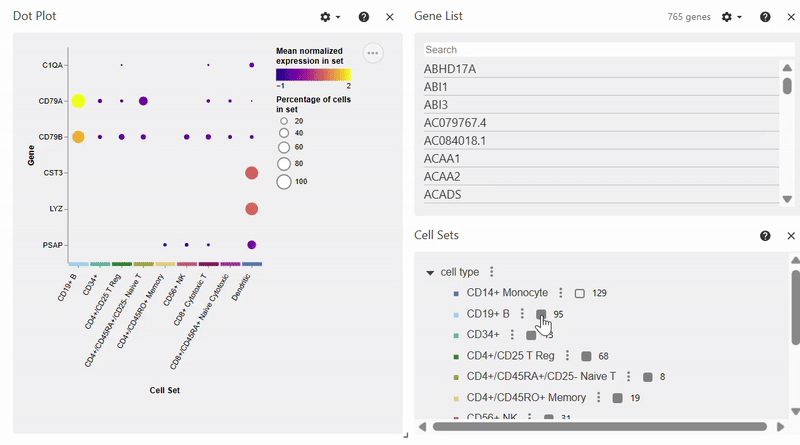

.. Easy Vitessce Documentation documentation master file, created by
   sphinx-quickstart on Fri Jul 25 15:27:51 2025.
   You can adapt this file completely to your liking, but it should at least
   contain the root `toctree` directive.

Easy Vitessce Documentation
=========================================

Easy Vitessce is a Python package for turning Scanpy and SpatialData plots into interactive `Vitessce <https://vitessce.io/>`_ visualizations with minimal code changes.

Installation
########################
Requires Python 3.10 or greater.

.. code-block::

   pip install easy_vitessce

How to Use and Examples
############################

The package can be imported with

.. code-block:: 

   import easy_vitessce as ev

Deactivating/Reactivating Interactive Plots
**************************************************
Passing ``disable_plots`` into ``ev.configure_plots`` will deactivate Vitessce plots.

Passing ``enable_plots`` into ``ev.configure_plots`` will reactivate Vitessce plots.

.. code-block:: 

   ev.configure_plots(disable_plots = ["embedding", "violin", "spatialdata-plot"])

   ev.configure_plots(enable_plots = ["spatialdata-plot", "violin"])

**Note:** While the parameters ``disable_plots`` and ``enable_plots`` can be specified at the same time, including the same plot in both lists will result in an error.

Spatial Plot (SpatialData version)
***********************************************
**Note:** This example uses SpatialData's `mouse brain MERFISH dataset. <https://spatialdata.scverse.org/en/latest/tutorials/notebooks/datasets/README.html>`_

.. code-block:: 

   sdata = sd.read_zarr(spatialdata_filepath)
   sdata.pl.render_images(element="rasterized").pl.render_shapes(element="cells", color="Acta2").pl.show()

``spatialdata_filepath`` should lead to a ``.zarr`` file containing spatial data with an ``Images`` folder. The file structure of the example above is as follows. Since it does not have a ``Labels`` folder, calling ``pl.render_labels()`` will not display any data.

.. code-block:: 

      SpatialData object, with associated Zarr store:
   ├── Images
   │     └── 'rasterized': DataArray[cyx] (1, 522, 575)
   ├── Points
   │     └── 'single_molecule': DataFrame with shape: (<Delayed>, 3) (2D points)
   ├── Shapes
   │     ├── 'anatomical': GeoDataFrame shape: (6, 1) (2D shapes)
   │     └── 'cells': GeoDataFrame shape: (2389, 2) (2D shapes)
   └── Tables
         └── 'table': AnnData (2389, 268)

|easy_vitessce_example|

Spatial Plot (Scanpy version)
********************************************
Easy Vitessce's ``spatial`` function also displays a spatial plot, but with Scanpy's syntax. This example uses Scanpy's `Visium dataset. <https://scanpy.readthedocs.io/en/stable/generated/scanpy.datasets.visium_sge.html>`_

.. code-block:: 

   adata = sc.datasets.visium_sge(sample_id="Targeted_Visium_Human_Glioblastoma_Pan_Cancer", include_hires_tiff=True)

   sc.pl.spatial(adata, color = "log1p_n_genes_by_counts")

.. image:: images/sc_spatial_documentation.gif

Scatterplots
**************************
Easy Vitessce's ``embedding`` function displays UMAP, PCA, and t-SNE scatterplots.

.. code-block:: 

   adata = sc.datasets.pbmc68k_reduced()

   sc.pl.embedding(adata, basis="umap", color="CD79A")
   sc.pl.embedding(adata, basis="pca", color=["CD79A", "CD53"])
   sc.pl.embedding(adata, basis="tsne", color=["bulk_labels", "louvain", "phase"])

*Example of UMAP using Easy Vitessce*

Dotplot
***********************
**Note:** To select/deselect multiple genes, hold SHIFT while clicking on genes in the Gene List. 

.. code-block:: 

   adata = sc.datasets.pbmc68k_reduced()

   sc.pl.dotplot(adata, markers = ["C1QA", "PSAP", "CD79A", "CD79B", "CST3", "LYZ"], groupby="bulk_labels")

Violin Plot
**************************

.. code-block:: 

   adata = sc.datasets.pbmc68k_reduced()

   sc.pl.violin(adata, markers = "AP2S1", groupby = "bulk_labels")

.. image:: /images/updated_violin.gif

Heatmap
*********************

.. code-block:: 

   adata = sc.datasets.pbmc68k_reduced()

   sc.pl.heatmap(adata, groupby = "bulk_labels", markers = ['C1QA', 'PSAP', 'CD79A', 'CD79B', 'CST3', 'LYZ'])

.. image:: /images/heatmap.gif

.. toctree::
   :maxdepth: 2
   :hidden:
   :caption: Contents

   easy_vitessce
   customization

